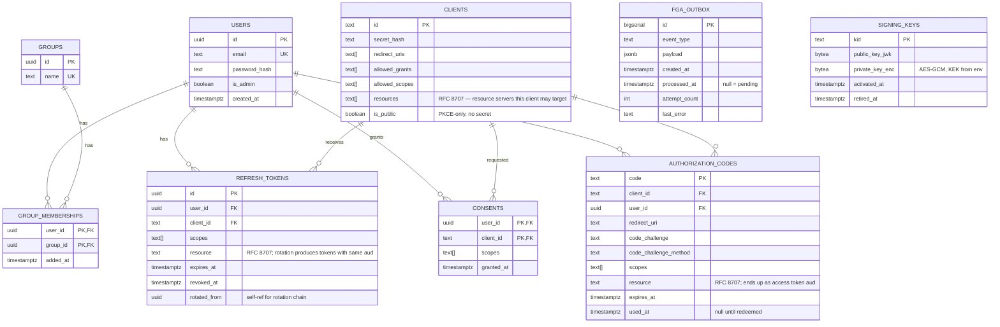
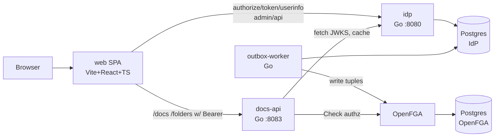
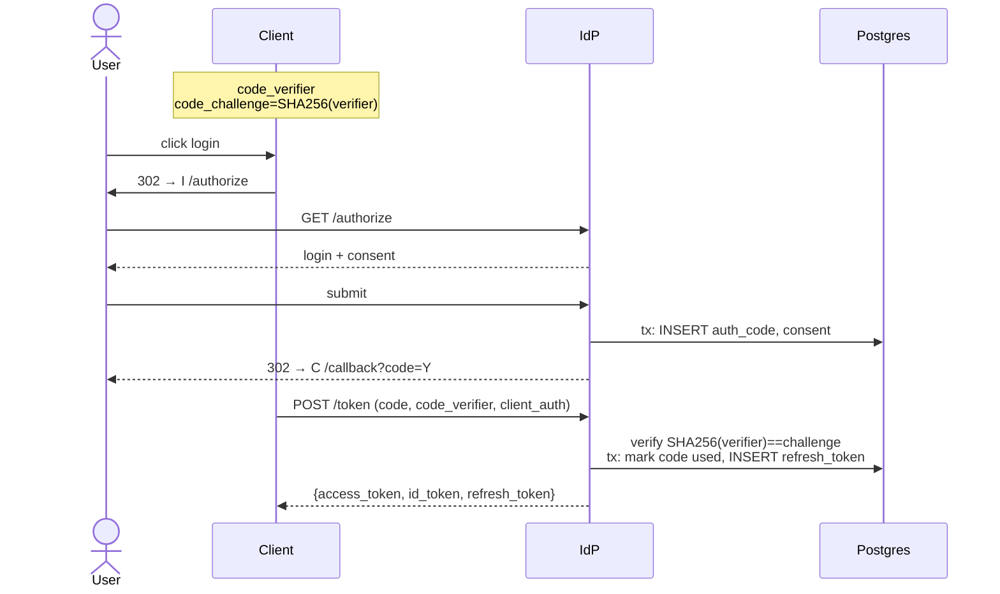
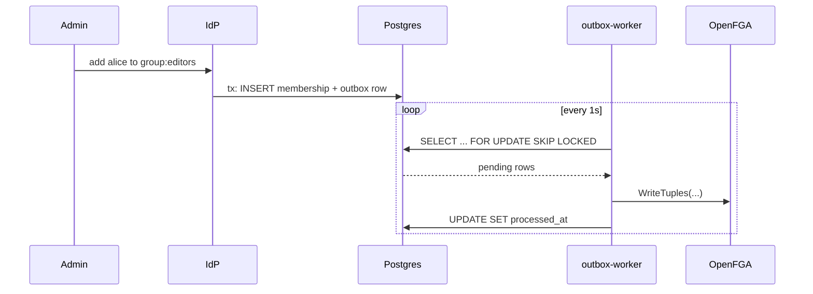
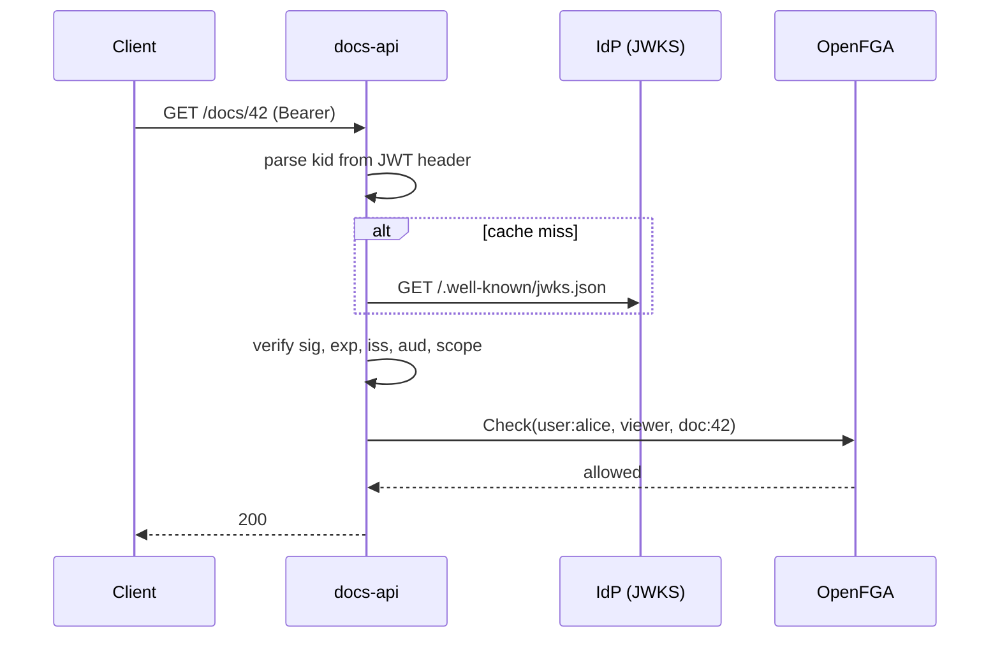

# identity-provider

> OIDC authorization server with a twist: identity changes sync to OpenFGA as relationship tuples via the outbox pattern. Subproject 2 of [sysdesign-lab](../../brain/projects/research/sysdesign-lab/status.md) — the claims-to-tuples bridge after url-shortener.

**Stack:** Go 1.25, Postgres 16, OpenFGA, Vite + React + TypeScript
**Status:** core complete — 9 backend layers + docs SPA + admin UI shipped, ~30 commits on `main`.

Deeper docs: [architecture](docs/architecture.md), [learning objectives](docs/learning_objectives.md), [tradeoffs](docs/tradeoffs.md), [RFCs](docs/rfcs.md).

---

## 1. Goals

**In scope:**
- OIDC authorization code + PKCE, end-to-end, validated against `oidc-client-ts` in a browser
- JWT access tokens with JWKS verification (no introspection — deliberate)
- ID tokens + `/userinfo`
- Refresh-token rotation with a 30s reuse-grace window for SPA correctness
- Scope-based access control + per-resource FGA checks
- Claims-to-tuples sync via outbox + worker
- Separate reference resource server (`cmd/docs-api`) doing real downstream JWT verification

**Out of scope** (deliberate, not oversights): capacity/SLOs, introspection (RFC 7662), federation, SAML, dynamic client registration (RFC 7591), multi-tenancy. See [tradeoffs](docs/tradeoffs.md) for the reasoning.

## 2. Learning Objectives

This is a protocol-and-correctness lab; numbers would be noise. Full treatment in [docs/learning_objectives.md](docs/learning_objectives.md). Headlines:

- **Primary:** OIDC code+PKCE from the inside, JWT/JWKS key management, refresh-token rotation, outbox pattern.
- **Named weak areas:** multi-issuer JWT validation, downstream signature verification, scope-vs-FGA distinction, token binding (DPoP — carried forward).
- **Stretch carried forward:** WebAuthn, DPoP, refresh-token family-graph, RFC 8693 token exchange.

## 3. API

### IdP (`cmd/idp`, :8080)

| Method | Path | Purpose |
|--------|------|---------|
| GET | `/.well-known/openid-configuration` | discovery (incl. `end_session_endpoint`) |
| GET | `/.well-known/jwks.json` | public signing keys |
| GET | `/authorize` | auth code + PKCE |
| POST | `/token` | code exchange / refresh rotation (30s reuse-grace) |
| GET | `/userinfo` | bearer-authenticated identity claims |
| GET/POST | `/login`, `/consent`, `/logout` | server-rendered protocol pages |
| GET | `/healthz` | liveness + Postgres reachability |
| ALL | `/admin/api/*` | admin JSON API (bearer + scope=admin + `is_admin`) |

**Admin API** (under `/admin/api`):

| Method | Path |
|--------|------|
| GET, POST | `/users` |
| POST | `/users/{id}/{promote,demote}` |
| GET, POST | `/groups` |
| GET, POST | `/groups/{name}/members` |
| DELETE | `/groups/{name}/members/{user_id}` |
| GET | `/outbox?status=pending\|failed\|all` |
| POST | `/outbox/{id}/retry` |
| DELETE | `/outbox/{id}?force=1` |
| GET, POST | `/clients` (POST returns plaintext secret ONCE) |
| GET, PATCH, DELETE | `/clients/{id}` |
| POST | `/clients/{id}/rotate-secret` (plaintext ONCE) |

### docs-api (`cmd/docs-api`, :8083)

Validates IdP-issued JWTs locally via JWKS HTTP cache; enforces scope + FGA Check.

| Method | Path | Scope | FGA |
|--------|------|-------|-----|
| GET | `/healthz` | — | — |
| GET | `/docs` | `read:docs` | per-doc viewer |
| GET | `/docs/{id}` | `read:docs` | viewer (404 hides on miss) |
| POST | `/docs` | `write:docs` | viewer-on-folder |
| PATCH | `/docs/{id}` | `write:docs` | editor |
| DELETE | `/docs/{id}` | `write:docs` | owner |
| GET | `/folders`, `/folders/{id}`, `/folders/{id}/docs` | `read:docs` | viewer |

### Frontend (`web/`, Vite :5173)

Vite + React + TypeScript SPA, two route trees, each with its own OAuth client + AuthProvider:
- `/`, `/docs/*` — docs product UI. Client `localdev-docs`, `resource=docs-api`, scopes `openid email read:docs write:docs`. Callback `/callback`.
- `/admin/{,users,groups,clients,outbox}` — admin UI. Client `localdev-admin`, `resource=idp-admin`, scopes `openid email admin`. Callback `/admin/callback`.

Per-tree `<AuthProvider>` with namespaced sessionStorage prefixes (`oidc.docs:` / `oidc.admin:`) so concurrent PKCE/state/nonce don't collide. Tokens stay in-memory only.

Dev proxy: `/api/docs` → :8083, `/api/admin` → :8080/admin/api.

## 4. Data Model

Three Postgres databases, owned by three services:

- **`postgres-idp`** (host :5434) — IdP-owned: users, clients, auth codes, refresh tokens, consents, signing keys, FGA outbox, sessions. Schema in `migrations/`. ERD below.
- **`postgres-docs`** (host :5435) — docs-api-owned: folders, documents. Schema in `cmd/docs-api/migrations/` (goose-managed); typed Go generated by sqlc from `cmd/docs-api/queries.sql`.
- **`postgres-fga`** (host :5433) — OpenFGA-owned tuple store. We don't write its schema.



`refresh_tokens.rotated_from` is nullable so the future family-graph reuse-detection drops in without migration. `signing_keys` enforces "at most one active" via partial unique index `signing_keys_one_active_idx`. `fga_outbox` is the protagonist — written in the same tx as the identity change, drained asynchronously.

## 5. Architecture



- **`idp`** — owns identity, clients, tokens, keys, sessions, admin API. Writes outbox rows in the identity-mutation transaction.
- **`outbox-worker`** — claims batches via `SELECT FOR UPDATE SKIP LOCKED`, translates events to OpenFGA tuple ops (per-tuple coalescing across a batch), idempotent on replay (`OnDuplicateWrites=ignore`).
- **`docs-api`** — separate binary so the "downstream service" lesson is concrete. Local JWKS cache with refresh-on-unknown-kid; scope check; FGA Check.
- **`web`** — single SPA, two route trees. `react-oidc-context`, in-memory tokens, scope-gated nav.
- **OpenFGA** — pinned to v1.14.2 (v1.10+ honors `OnDuplicateWrites`/`OnMissingDeletes`). External, opaque service.

### Auth code + PKCE



### Identity change → tuple



### docs-api validates and authorizes



## 6. Tradeoffs & Decisions

Smaller decisions in [docs/tradeoffs.md](docs/tradeoffs.md). The big ones:

- **JWT access tokens, no introspection.** Self-validating tokens via JWKS, no per-request IdP round-trip. Revocation is weaker (token valid until `exp`); accepted as a conscious cost.
- **Outbox pattern for FGA sync.** Identity write + outbox row in one Postgres tx; worker drains async. Decouples IdP availability from FGA availability. Synchronous writes rejected (couples uptimes); CDC stream rejected as premature with a single consumer.
- **Refresh-token rotation (Level 2) with 30s reuse-grace, no family-graph yet.** Grace window absorbs the canonical browser-SPA race (StrictMode, tab refocus, network retry). Family-graph reuse detection is a strict-mode upgrade on top, carried forward.
- **Separate Postgres for IdP, docs-api, and OpenFGA.** Three clusters in compose. Mirrors realistic service ownership; keeps "who owns which data" honest.
- **sqlc + goose for docs-api persistence (not an ORM).** Schema-first SQL; generated typed Go from `cmd/docs-api/queries.sql`. Modern Go default — closest thing to Django-style ergonomics without an ORM's runtime opacity. IdP keeps its hand-written `pgx` style.
- **Server-rendered HTML for `/login` + `/consent`, SPA for product surfaces.** Auth pages are protocol; product pages (docs, admin) are UI work where React earns its weight.
- **RFC 8707 resource indicators + two-client SPA model.** Access tokens carry `aud=<resource-server>` (e.g. `docs-api`, `idp-admin`), not `aud=<client_id>`. The SPA splits across `localdev-docs` and `localdev-admin` to match — each tree mounts its own `<AuthProvider>` with namespaced sessionStorage. ID tokens still use `aud=<client_id>` per OIDC Core. `/userinfo` is a deliberate exception (no aud check) because it's served by the issuer; matches Auth0/Okta/Google.

## 7. Bottlenecks & Scaling

N/A by scope. (If real: token endpoint is hot path; Postgres bottlenecks first; JWKS caches trivially; outbox worker concurrency scales with `SKIP LOCKED` partitioning.)

## 8. Failure Modes

| Failure | Detection | Recovery |
|---------|-----------|----------|
| OpenFGA down | worker write fails | retries with backoff; outbox accumulates; IdP unaffected |
| Postgres down | any handler | 503; identity writes fail (acceptable) |
| JWKS cache stale | sig verify fails on unknown kid | docs-api refetches |
| Refresh token revoked mid-flight | /token | 400 invalid_grant; client re-auths |
| Worker crashes mid-batch | row keeps `processed_at IS NULL` | next worker claims via SKIP LOCKED; FGA writes idempotent |

## 9. Running It Locally

```bash
cd ~/Projects/sysdesign-lab/identity-provider

# 1. Infra
make up                     # docker compose up -d
make migrate                # IdP schema (psql-driven)
make migrate-docs           # docs-api schema (goose-driven)

# 2. First-time bootstrap: secrets + signing key + dev user (stable
#    UUID via `idp users create --id`) + FGA store init + docs-api
#    schema + grants for the dev user on the seeded corpus.
#    Idempotent on re-run.
make dev-all

# 3. One-time SPA dependency install
make web-install

# 4. Start everything backgrounded (idp + outbox-worker + docs-api + vite).
#    Logs in /tmp/idp-*.log. Tint-colored when LOG_FORMAT=pretty (set by
#    dev-up).
make dev-up

# 5. Watch the four service logs in a tmux 2x2 grid (Ctrl-B d to detach
#    without stopping services; Ctrl-B + arrows to navigate panes).
make dev-tail

# 6. Browser: http://localhost:5173. Log in as
#      smoke-alice@example.com / correct-horse-battery-staple
#    For admin UI: visit /admin (separate login under the admin client).
#    First time, promote alice:
./bin/idp users promote smoke-alice@example.com
#    Then sign out and back in to pick up the admin scope.

# 7. Stop everything
make dev-down               # backgrounded services
make down                   # docker compose

# Smoke scripts (run while dev-up is up):
bash scripts/dev_flow.sh    # protocol regression via curl
bash scripts/docs_smoke.sh  # full triangle: token → docs-api → FGA Check
```

For one-service-in-foreground debugging (when you want crashes to hit
your terminal directly), `make dev-serve` runs only the IdP. The other
two services need a manual `LOG_FORMAT=pretty ./bin/<svc>` invocation
in that case.

## 10. Benchmarks

N/A by scope.

## 11. Retrospective

**What landed:** all 4 primary objectives ✓; 3 of 4 named gaps ✓ (DPoP carries forward); both SPAs shipped; refresh-grace ✓. Detail in [docs/learning_objectives.md](docs/learning_objectives.md).

**Surprises:**
- The OAuth/OIDC core spec is much smaller than the Auth0/Okta product surface — once you cut introspection, dynamic client registration, and federation, it's ~5 round-trips and a JWKS endpoint.
- The outbox worker was 200 lines once the `Enqueue(tx)` contract was in place. The hard part was per-tuple coalescing — discovered when a real smoke test hit `cannot_allow_duplicate_tuples_in_one_request` and a delete-of-missing-tuple from FGA.
- Strict refresh-token rotation works fine for curl but breaks browser SPAs the moment React StrictMode + `react-oidc-context` enter the picture. Okta and Auth0 both ship a grace window for the same reason.
- `Store` interfaces from day 1 made testing nearly free — every layer has either an in-memory fake or a real-Postgres skip-on-unreachable test. No mocks, no fixtures-as-yaml.
- OpenFGA's Write API doesn't consult the authz model — `(user:alice, viewer, document:does-not-exist)` is happily stored. The model only matters at Check time.

**Ratchet for the next subproject:**
- Skip introspection + dynamic-registration tangents earlier — they're product surface, not protocol learning.
- Wire the SPA as a smoke target by layer 5, not layer 9. Curl tests are necessary but not sufficient (CORS, audience semantics, consent-form param shape — all only surface from a real browser).
- The interface-first persistence pattern is the keeper.

**Carry forward:** WebAuthn / passkeys, DPoP, refresh-token family-graph reuse detection, RFC 8693 token exchange, auto signing-key rotation, self-serve user registration.
