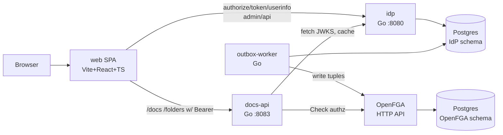
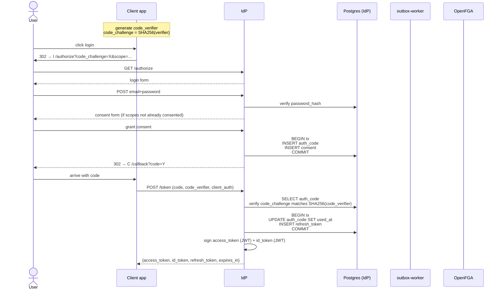
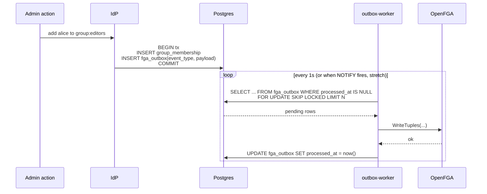

# identity-provider

> An OIDC-compliant authorization server with a twist: identity changes sync as FGA relationship tuples via the outbox pattern. Second subproject in [sysdesign-lab](../../brain/projects/research/sysdesign-lab/status.md) — the claims-to-tuples bridge project matt picked up after url-shortener.

**Language/stack:** Go 1.25, Postgres 16, OpenFGA (Apache 2.0 ReBAC engine), Vite + React + TypeScript (frontend)
**Category:** interview-classic (OIDC) + skill-breadth (identity infra patterns)
**Status:** core complete — all 9 backend layers shipped, both frontends shipped (docs SPA + admin UI), refresh-token reuse grace window for SPA correctness. ~30 commits on `main`.
**Repo:** local only (will push to GitHub when ready)

---

## 1. Goals

### Functional
- Full **OIDC authorization code flow with PKCE**, end-to-end, validated against `oidc-client-ts` in a browser
- **JWT access tokens** with JWKS-based verification. No introspection endpoint (deliberate)
- **ID tokens** + `/userinfo` endpoint
- **Refresh tokens with rotation** (each use invalidates the old, issues new)
- **Scope-based access control** — clients request scopes at `/authorize`, user consents, scopes land in access tokens, downstream API enforces
- **Claims-to-tuples sync** — user/group membership changes in the IdP emit FGA tuple writes via the outbox pattern
- **Separate reference API** (`cmd/docs-api`) that validates tokens against JWKS locally and enforces FGA checks — demonstrates the downstream-service side of the protocol

### Non-functional / scope cuts
- **No capacity estimates or SLOs** — deliberate. This is a protocols-and-correctness learning project, not a scale story. Numbers would be noise.
- **No introspection endpoint** — we chose JWT self-validation. RFC 7662 is out of scope.
- **No federation** — no Google/GitHub upstream login. Local email/password only.
- **No SAML.**
- **No client-registration UI** — client registration via migration/SQL seed only. (Admin UI exists for users/groups/outbox; client management is CLI/SQL.)
- **No multi-tenancy.** Single-tenant design; multi-tenant is a later subproject.
- **No dynamic client registration** (RFC 7591) — static clients seeded in migrations.

### Out of scope for subproject 2 (candidates for I3+)
- Higher-level policy DSL over FGA → subproject 3
- Auth gateway tying I2 + I3 + OpenFGA together → subproject 4
- Multi-tenant SaaS around all three → later

## 2. Learning Objectives

This is an RFC-driven learning project. Template §2 (capacity estimates) intentionally replaced with explicit learning targets so they don't get lost.

**Primary:**
- **OIDC authorization code flow with PKCE from the inside** — understand *why* each parameter exists, not just what the spec says
- **JWT + JWKS key management** — signing, key rotation (`kid` lookup), client-side caching of the JWKS endpoint
- **Refresh token rotation** — the state machine + DB schema for "each use invalidates previous"
- **Outbox pattern** — transactional identity write + async propagation to FGA

**Named learning gaps** (matt flagged these as weakest areas):
- **Issuer validation with multiple possible issuers** — demo API configured to accept tokens from our IdP *and* a mock second issuer; implement per-issuer JWKS cache and `iss` allowlist, discover the sharp edges (`kid` collisions, key rotation timing)
- **Downstream signature verification** — demo API as a separate binary that never calls back to the IdP per-request; validates entirely via JWKS. Includes deliberate forged-token test case and key-rotation simulation
- **Scope-based authz** — the subtle distinction between "scope" (what the user/client is allowed to ask for) and "authz decision" (can this specific resource access happen); scopes in tokens, FGA tuples decide fine-grained
- **Token binding (DPoP, RFC 9449)** — stretch: one endpoint on the demo API that requires a DPoP-bound access token, to feel what problem sender-constraining solves. Not a full implementation

**Secondary (stretch):**
- WebAuthn/passkeys as second factor (after core works)
- Refresh token reuse detection (family graph)
- Token exchange (RFC 8693)

## 3. API

### IdP endpoints (`cmd/idp`, host :8080)

| Method | Path | Purpose | Auth |
|--------|------|---------|------|
| GET | `/.well-known/openid-configuration` | OIDC discovery (incl. `end_session_endpoint`) | none, CORS |
| GET | `/.well-known/jwks.json` | public signing keys | none, CORS |
| GET | `/authorize` | begin auth code flow + PKCE | user login required |
| POST | `/token` | code exchange, refresh-token rotation w/ 30s reuse grace | client auth, CORS |
| GET | `/userinfo` | identity claims for current bearer | bearer, CORS |
| GET/POST | `/login` | login form (HTML) | — |
| GET/POST | `/consent` | consent form (HTML); silently filters `admin` scope for non-admin users | user session |
| GET/POST | `/logout` | RP-initiated logout (`post_logout_redirect_uri` honored) | session-aware |
| GET | `/healthz` | liveness + Postgres reachability | none |
| ALL | `/admin/api/*` | admin JSON API (see Admin API below) | bearer, scope=admin |

**Admin API** (under `/admin/api`, requires `admin` scope + `is_admin=true`):

| Method | Path | Description |
|--------|------|-------------|
| GET | `/users` | list users with `is_admin` flag |
| POST | `/users` | create user (email + password) |
| POST | `/users/{id}/promote` | set `is_admin=true` |
| POST | `/users/{id}/demote` | set `is_admin=false` |
| GET | `/groups` | list groups |
| POST | `/groups` | create group |
| GET | `/groups/{name}/members` | list members |
| POST | `/groups/{name}/members` | add member (atomic with outbox event) |
| DELETE | `/groups/{name}/members/{user_id}` | remove member (atomic with outbox event) |
| GET | `/outbox?status=pending\|failed\|all` | inspect outbox rows |
| POST | `/outbox/{id}/retry` | reset attempt_count for a poison-pill row |
| DELETE | `/outbox/{id}?force=1` | purge (refuses pending rows without `force=1`) |

### docs-api endpoints (`cmd/docs-api`, host :8083)

Separate binary that validates IdP-issued JWTs locally via JWKS HTTP cache and enforces fine-grained authz via OpenFGA Check.

| Method | Path | Scope | FGA Check | Description |
|--------|------|-------|-----------|-------------|
| GET | `/healthz` | — | — | liveness |
| GET | `/docs` | `read:docs` | per-doc viewer | list user-viewable docs with `permission` tier |
| GET | `/docs/{id}` | `read:docs` | viewer | fetch one (404 hides existence on no access) |
| POST | `/docs` | `write:docs` | viewer-on-folder | create + write owner tuple to FGA |
| PATCH | `/docs/{id}` | `write:docs` | editor | edit |
| DELETE | `/docs/{id}` | `write:docs` | owner | delete + remove owner tuple |
| GET | `/folders` | `read:docs` | per-folder viewer | list user-viewable folders |
| GET | `/folders/{id}` | `read:docs` | viewer | one folder with permission tier |
| GET | `/folders/{id}/docs` | `read:docs` | folder + per-doc viewer | docs in a folder |

### Frontend (`web/`, Vite dev server :5173, dev-proxied to :8080 + :8083)

Mono-frontend Vite + React + TypeScript SPA. Two route trees:
- `/` (landing) → `/docs` — docs product UI: folder tree sidebar, doc list, detail with permission badges, edit/delete gated by tier
- `/admin/{,users,groups,outbox}` — admin UI gated by `admin` scope; tile dashboard, user/group/membership management, outbox inspection with retry/purge

## 4. Data Model

Postgres, IdP schema. Separate Postgres database for OpenFGA's tuple store (owned by OpenFGA itself).


### Notes on key design choices
- **`authorization_codes`** — short-lived (~60s per RFC). `used_at` enforces single-use (RFC 6749 §4.1.2); attempt to reuse invalidates any tokens already issued from this code (stretch)
- **`refresh_tokens.rotated_from`** — nullable self-ref. Lets us build the rotation chain for the reuse-detection stretch later without schema churn
- **`consents`** — caching user consent so the consent screen only shows on first authz or on scope changes
- **`fga_outbox`** — the protagonist of the novel work. Written in the same tx as the identity change; worker drains asynchronously
- **`signing_keys`** — explicit table so key rotation is observable. Private keys encrypted at rest (using a KEK from env var; deliberately simple — real KMS is out of scope)

## 5. Architecture



### Component responsibilities

- **`idp`** — OIDC authorization server. Owns user identity, client registry, token issuance, key management. Hosts the admin JSON API at `/admin/api/*` (scope=admin, defense-in-depth `is_admin` flag). Writes FGA outbox entries in the same transaction as identity mutations.
- **`outbox-worker`** — claims batches of pending outbox rows (SELECT FOR UPDATE SKIP LOCKED), translates to OpenFGA tuple writes (with per-tuple coalescing across a batch), marks processed. Idempotent on replay via OpenFGA's `OnDuplicateWrites=ignore`.
- **`docs-api`** — separate binary to make the "downstream service" lesson concrete. Validates JWTs locally via JWKS (cached, with key rotation awareness), enforces scope, calls FGA for fine-grained checks. Serves an in-memory doc/folder corpus with permission-tier-enriched responses.
- **`web`** (SPA) — single Vite + React + TS frontend. Two route trees: docs product (`/docs`) and IdP admin (`/admin`, scope-gated). One auth provider, shared `useAuthedFetch` hook, dev-time proxies `/api/docs` → :8083 and `/api/admin` → :8080.
- **OpenFGA** — the tuple store + check engine. We use it as an opaque service; we are *not* reimplementing Zanzibar internals. Pinned to v1.14.2 (v1.10+ honors `OnDuplicateWrites` / `OnMissingDeletes` flags).
- **Postgres (×2)** — one database for the IdP, one for OpenFGA (owned by OpenFGA). Deliberate separation; reflects realistic deployment.

### Key request flow — authorization code + PKCE



### Key request flow — identity change → tuple



### Key request flow — docs-api validates and authorizes


## 6. Tradeoffs & Decisions

### Decision: JWT access tokens, no introspection
- **Chose:** self-validating JWTs signed by the IdP, verified locally by downstream services via JWKS
- **Rejected:** opaque tokens with a `/introspect` endpoint (RFC 7662)
- **Why:** matches modern deployment patterns, no per-request IdP round-trip, lets us focus on the cryptographic-verification and key-rotation lessons that are the weak areas matt called out. Revocation is weaker (tokens valid until expiry) — we accept that; it's a conscious choice, not an oversight
- **When this would change:** if revocation latency had to be sub-second, or if token contents were sensitive enough that we didn't want them readable by clients (JWTs are base64, not encrypted by default)

### Decision: Outbox pattern for FGA tuple sync (not synchronous writes, not CDC)
- **Chose:** identity mutation + outbox row in same Postgres transaction; worker drains outbox → OpenFGA
- **Rejected:**
  - *Synchronous* (write to FGA in the same request): couples IdP uptime to FGA uptime, makes FGA a hard dependency for identity operations. Unacceptable.
  - *CDC stream via Redis/Kafka*: cleaner for multi-consumer scenarios (audit log + FGA), but adds an extra service with no single-consumer benefit right now. Revisit at I4/I5 when we genuinely have multiple consumers.
- **Why:** outbox gives us transactional consistency between identity state and pending FGA writes, decouples availability, and is the widely-understood realistic pattern. `SELECT ... FOR UPDATE SKIP LOCKED` gives us work-stealing across multiple workers for free.
- **When this would change:** if we needed >1 consumer of identity events, the outbox row would become a publish to a Redis Stream or Kafka and we'd add fan-out

### Decision: Refresh token rotation (Level 2) with reuse grace, no family-graph yet
- **Chose:** each use of a refresh token invalidates it and issues a new one. Single linear chain.
- **Rejected (for now):** reuse detection via refresh_token family graph (OAuth 2.1 BCP). Tracked as a stretch.
- **Why:** the rotation mechanism is the core learning; reuse detection is a ~2x scope bump with diminishing returns for a lab. Schema includes `rotated_from` so we can add the family graph later without migration.
- **When this would change:** if we ever deployed this for real; reuse detection is required for any production IdP

### Decision: Separate Postgres database for OpenFGA
- **Chose:** two Postgres containers in compose — one for IdP schema, one for OpenFGA's tuple store
- **Rejected:** one Postgres with two databases/schemas
- **Why:** mirrors realistic deployment shape (auth provider + authz engine are separate concerns with separate operational profiles). The "who owns which data" question stays honest. Minor: lets us exercise the outbox worker's cross-database story.
- **When this would change:** cost-sensitive staging/dev; keep it split in prod

### Decision: Server-rendered HTML for login + consent, SPA for product surfaces
- **Chose:** the OAuth/OIDC protocol pages (`/login`, `/consent`) stay server-rendered HTML; the *product* surfaces (docs UI, admin UI) live in a single Vite + React + TypeScript SPA at `/web`
- **Rejected:** running everything as one SPA (would force the login flow into a SPA-based redirect loop, which is *less* representative of how most IdPs deploy)
- **Why:** the auth-code+PKCE pages are protocol pages; rendering them server-side keeps the protocol the hero and matches real-world IdP deployments. The product surfaces (browse docs / manage admin) are UI work, where a real SPA framework actually pays its weight (typed API client, React Query for cache, scope-gated nav, etc.).
- **When this would change:** if WebAuthn lands in the stretch, the registration/authentication pages would need client-side JS; we'd add it inline rather than convert the login flow to a SPA.

### Decision: Refresh-token reuse grace window (30s) for SPA correctness
- **Chose:** when a refresh token is presented twice within 30s of being rotated, return the cached response from the first call instead of `invalid_grant`
- **Rejected:** strict invalidation (the OAuth 2.1 BCP default) — too brittle for browser SPAs where parallel renewals are unavoidable
- **Why:** the canonical browser-SPA race (React StrictMode double-mount, tab refocus mid-renewal, network retry) makes parallel refresh-token presentations the norm, not an exception. Okta and Auth0 both implement a small grace window for the same reason. OAuth 2.1 BCP allows it provided the window is short and bounded.
- **Where:** `internal/oauth/refresh_grace.go` — in-memory TTL map, hash-keyed, 30s window. Lost on IdP restart (acceptable cost: worst case is one client gets `invalid_grant` and re-auths).
- **When this would change:** if reuse-detection-via-family-graph (stretch) lands, the grace window can stay; the family-graph would still revoke a chain when the *same* token is presented *outside* the grace window.

## 7. Bottlenecks & Scaling

N/A by scope. Lab project. Not pursuing.

(If this became real: token endpoint is the hot path; Postgres becomes the bottleneck somewhere; JWKS endpoint caches trivially; refresh token issuance is write-heavy; outbox worker concurrency scales with `SKIP LOCKED` partitioning.)

## 8. Failure Modes

| Failure | Detection | Recovery |
|---------|-----------|----------|
| OpenFGA down | outbox-worker insert fails | retry with backoff; outbox accumulates; /healthz flags. IdP continues issuing tokens. |
| Postgres down | any handler | return 503; graceful shutdown; identity writes fail — acceptable |
| Signing key expired | sign fails | rotate keys (stretch: auto-rotate); current_key check at startup |
| JWKS cache stale on docs-api | signature verify fails | docs-api refetches JWKS on unknown `kid`; tests this path |
| Refresh token revoked mid-flight | /token returns 400 invalid_grant | client re-authenticates |
| Worker crashes mid-batch | outbox row still has `processed_at IS NULL` | next worker claims via SKIP LOCKED; idempotent writes to FGA |
| Duplicate outbox processing | at-least-once delivery | FGA tuple writes are idempotent; same tuple written twice is a no-op |

## 9. Running It Locally

```bash
cd ~/Projects/sysdesign-lab/identity-provider

# 1. Infra: Postgres (x2) + OpenFGA
docker compose up -d
make migrate

# 2. First-time setup (KEK + CSRF secrets, signing key, dev user, FGA store)
make dev-all
source /tmp/idp-env
go run ./cmd/idp fga init   # prints OPENFGA_STORE_ID + OPENFGA_AUTHORIZATION_MODEL_ID
# append those to /tmp/idp-env

# 3. Run the binaries (separate terminals)
make run-idp                # :8080
make run-outbox-worker
ALICE_SUB=$(docker exec identity-provider-postgres-idp-1 \
    psql -U idp -d idp -tAc "SELECT id FROM users WHERE email='smoke-alice@example.com'")
TRUSTED_ISSUERS=http://localhost:8080 REQUIRED_AUD=localdev \
DOCS_SEED_ALICE=$ALICE_SUB ALLOWED_ORIGINS=http://localhost:5173 \
    make run-docs-api       # :8083

# 4. Frontend (in /web)
make web-install            # one-time
make web-dev                # :5173

# 5. Smoke tests
bash scripts/dev_flow.sh    # protocol regression: full auth-code + PKCE via curl
bash scripts/docs_smoke.sh  # end-to-end: token → /docs/{id} → FGA Check returns allowed

# 6. Browser
# Visit http://localhost:5173, log in as smoke-alice@example.com /
# correct-horse-battery-staple. To exercise admin UI:
go run ./cmd/idp users promote smoke-alice@example.com
# (then sign out + back in to get a token with the admin scope)
```

## 10. Benchmarks

N/A by scope. Learning project, not scale project.

## 11. Retrospective

### Learning objectives — what landed where

**Primary objectives from §2:**

- **OIDC authorization code + PKCE from the inside** — `internal/oauth/authorize.go` (the redirect-back-with-code state machine), `internal/oauth/codes.go` (single-use codes with PKCE challenges), `internal/oauth/token.go` (`/token` exchange + verifier comparison). The "from the inside" understanding came from the test fixtures — every parameter exists because it closes a specific attack: `state` for CSRF, `nonce` for replay, `code_verifier` because the redirect URI is browser-visible.
- **JWT + JWKS key management** — `internal/tokens/keys.go` (3-state rotation: PENDING → ACTIVE → RETIRED, partial unique index on "exactly one active"), `internal/tokens/jwks.go` (wire format), `internal/tokens/jwt.go` (sign + verify with `kid` lookup). Real lesson: rotation is two write ops on different rows, never a state change on a single row, and the partial unique index is what makes "no two actives" race-safe.
- **Refresh token rotation** — `internal/tokens/refresh.go` (`Rotate` does BEGIN tx + SELECT FOR UPDATE + revoke old + insert new). 8-goroutine race test in `refresh_test.go` proves exactly one wins. Sub-lesson learned later: strict rotation breaks browser SPAs (see §6 grace window decision).
- **Outbox pattern** — `internal/outbox/{events,store,translate}.go` (typed events + `Enqueue(tx)` insists on a `pgx.Tx` so atomicity is compile-time-enforced) + `cmd/outbox-worker/main.go` (claim via `SELECT FOR UPDATE SKIP LOCKED`, per-tuple coalesce, attempt_count cap). Most surprising part: the dedup logic for "user added then removed before drain" — a literal "last op wins" is wrong if the result is a delete on a tuple FGA never knew about.

**Named learning gaps from §2:**

- **Issuer validation with multiple possible issuers** — `internal/tokens/jwt.go` `Verifier` takes `map[string]KeyResolver` as the issuer allowlist; the keyfunc resolves the public key per-iss after parsing the unsigned token. Test in `internal/jwks/cache_test.go` (`TestIntegration_VerifierAcceptsFetchedKey`) wires a real `httptest.Server` standing in as the IdP and confirms a token signed with its key validates end-to-end through the cache. Bonus: docs-api's middleware tests (`cmd/docs-api/auth_test.go`) include the negative case — a token from `http://other` (legitimate but untrusted issuer) is rejected.
- **Downstream signature verification** — `cmd/docs-api/main.go` builds one `jwks.Cache` per trusted issuer and passes them to `tokens.NewVerifier`. The cache is the rotation-aware piece: `internal/jwks/cache.go` triggers a refetch on unknown `kid` (test: `TestResolve_UnknownKid_TriggersRefetch`). Lab's smoke test (`scripts/docs_smoke.sh`) drives the full triangle: IdP issues token → docs-api fetches JWKS over HTTP → token validates → FGA Check returns allowed.
- **Scope-based authz vs FGA tuples** — split: `cmd/docs-api/auth.go` (`requireScope("read:docs")`) gates the *API surface*; `cmd/docs-api/handlers.go` (`resolvePermission`) gates the *resource*. Two distinct enforcement points. The `permission` field returned to the SPA is computed by running 3 FGA checks in highest-first order (owner / editor / viewer) so the UI can show/hide affordances.
- **Token binding (DPoP, RFC 9449)** — *not done*. Carried forward as a stretch in the next subproject.

**Secondary stretch goals from §2:**
- WebAuthn/passkeys — *not done*. Carried forward.
- Refresh token reuse detection (family graph) — *not done* in family-graph form, but landed a 30s **reuse grace window** instead (`internal/oauth/refresh_grace.go`). The grace window is what real IdPs (Okta, Auth0) ship; the family graph is a strict-mode upgrade on top.
- Token exchange (RFC 8693) — *not done*. Carried forward.

### Surprises vs expectations

- **The OAuth/OIDC spec is much smaller than the Auth0/Okta product surface.** Once you ignore introspection, dynamic client registration, federation, and the half-dozen optional extensions, the actual protocol is ~5 round-trips and a JWKS endpoint. Most of "auth complexity" in real systems is lifecycle + tooling on top of this small core.
- **The outbox pattern is short.** I expected the worker to be the hard part; the 200-line `cmd/outbox-worker/main.go` was nearly all done in one sitting once the Enqueue-takes-pgx.Tx contract was in place. The hard part was the per-tuple coalescing fix that emerged from a real smoke-test failure (W+D on a tuple FGA didn't know about → delete-of-missing error).
- **Browser SPAs make refresh-token rotation harder than the spec implies.** Strict rotation works fine for a single-threaded curl-driven test; the moment you put it behind `react-oidc-context` + React StrictMode you hit parallel refresh races. The 30s grace window is the answer real IdPs converged on.
- **Testing is mostly free if you write `Store` interfaces from day 1.** Every layer's tests use either an in-memory fake or a real Postgres connection (skip-on-unreachable). No mocking framework, no test containers, no fixtures-as-yaml. The interface boundary is the seam.
- **OpenFGA's Write API is dumber than I expected.** It does not consult the authorization model at write time. You can write `(user:alice, viewer, document:does-not-exist)` and it'll happily store it. The model only matters at Check time. Correct conceptually (it's a relationship store, not an authz engine until Check), but it changes how you think about defensive validation.
- **Tailwind v4's CSS-first config is genuinely better than v3's `tailwind.config.js`.** First time using v4; one `@import "tailwindcss"` line and you're done.

### RFCs / specs touched

| Spec | Where used | One-line takeaway |
|------|------------|-------------------|
| RFC 6749 (OAuth 2.0) | All `/authorize`, `/token`, error responses | The error vocabulary alone (`invalid_grant`, `invalid_request`, etc.) is worth memorizing |
| RFC 7636 (PKCE) | Auth code flow | `S256` is the only mode you should ship; `plain` exists for backwards compat with broken clients |
| RFC 7517 (JWK) | JWKS endpoint | OKP/Ed25519 wire format is a 5-field JSON object; nothing to it once you internalize that JWKs are just public-key envelopes with metadata |
| RFC 7519 (JWT) | Access + ID tokens | The "registered claims" (`iss`, `sub`, `aud`, `exp`) are stricter than they look — every one rejects more than it admits |
| OpenID Connect Core 1.0 | `/userinfo`, ID tokens, discovery, RP-initiated logout | The OIDC layer on top of OAuth is small — discovery doc + `id_token` shape + `nonce` echo |
| RFC 6750 (Bearer Tokens) | docs-api + admin API auth middleware | The `WWW-Authenticate: Bearer error="..."` header convention matters; SPAs key off it |
| RFC 9068 (JWT profile for OAuth access tokens) | Access claim shape | Optional but the `client_id` claim is what makes per-client revocation tractable |
| draft-ietf-oauth-security-topics (BCP) | Refresh-token grace window decision | Permits short-window reuse caches when documented; cited in `internal/oauth/refresh_grace.go` |

### Ratchet for next subproject

Things I'd do differently / would build on:
- **Skip the introspection + registration tangents earlier.** I had to be told twice that they were out of scope for the lesson. They're product surface, not protocol learning.
- **Wire the SPA earlier as a smoke target.** A working browser flow at layer 5 would have caught the consent-form param issues before layer 9. Curl-driven smoke tests are necessary but not sufficient — there are bugs (the IdP-issues-`aud=client_id` thing, the missing CORS) that only surface from a real browser.
- **The interface-first / Store-interface pattern is the keeper.** Every test is fast because there's a fake on the other side of every persistence call. That's the takeaway to carry forward.

### Ledger of in-flight stretch goals (not done; carry forward)

- WebAuthn / passkeys
- DPoP (RFC 9449) — sender-constraining one demo endpoint
- Refresh-token family-graph reuse detection (the strict mode on top of the grace window)
- Token exchange (RFC 8693)
- Auto signing-key rotation
- A `users register` self-serve flow (currently admin-only via `/admin/api/users`)
