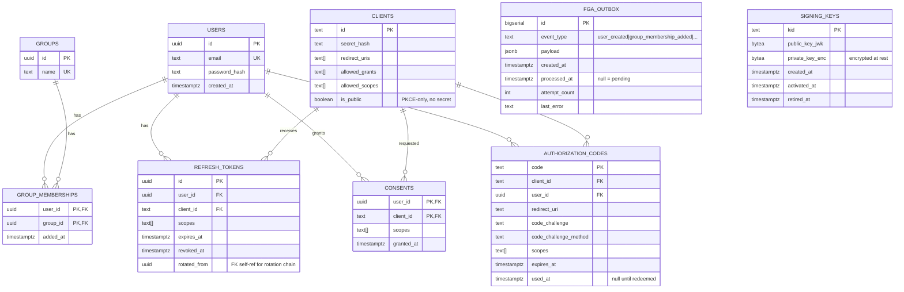
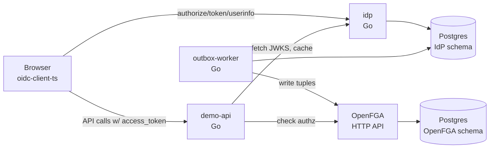
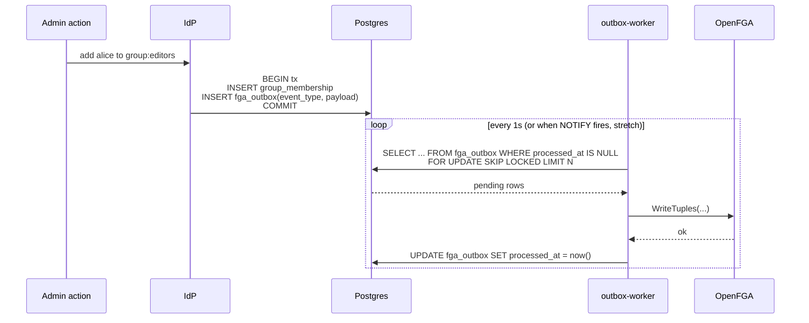
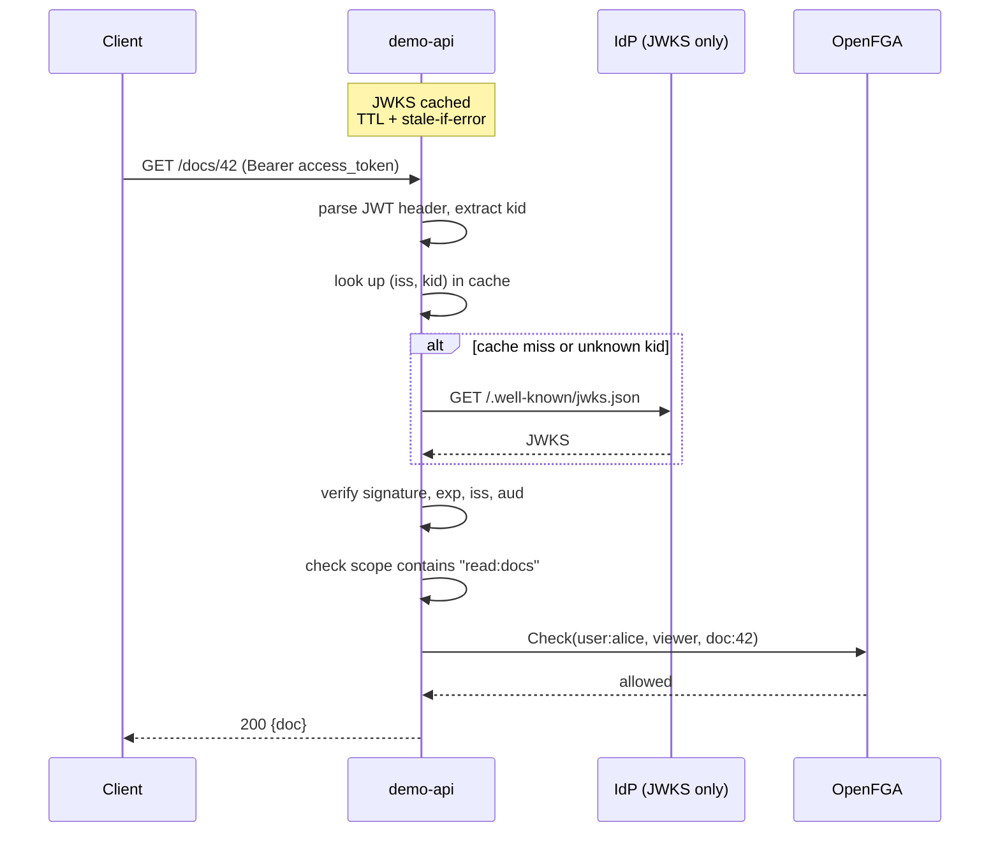

# identity-provider

> An OIDC-compliant authorization server with a twist: identity changes sync as FGA relationship tuples via the outbox pattern. Second subproject in [sysdesign-lab](../../brain/projects/research/sysdesign-lab/status.md) — the claims-to-tuples bridge project matt picked up after url-shortener.

**Language/stack:** Go 1.25, Postgres 16, OpenFGA (Apache 2.0 ReBAC engine)
**Category:** interview-classic (OIDC) + skill-breadth (identity infra patterns)
**Status:** scaffolding — design doc in place, implementation pending
**Repo:** local only (will push to GitHub when ready)

---

## 1. Goals

### Functional
- Full **OIDC authorization code flow with PKCE**, end-to-end, validated against `oidc-client-ts` in a browser
- **JWT access tokens** with JWKS-based verification. No introspection endpoint (deliberate)
- **ID tokens** + `/userinfo` endpoint
- **Refresh tokens with rotation** (each use invalidates the old, issues new)
- **Scope-based access control** — clients request scopes at `/authorize`, user consents, scopes land in access tokens, downstream API enforces
- **Claims-to-tuples sync** — user/group membership changes in the IdP emit FGA tuple writes via the outbox pattern
- **Separate reference API** (`cmd/demo-api`) that validates tokens against JWKS locally and enforces FGA checks — demonstrates the downstream-service side of the protocol

### Non-functional / scope cuts
- **No capacity estimates or SLOs** — deliberate. This is a protocols-and-correctness learning project, not a scale story. Numbers would be noise.
- **No introspection endpoint** — we chose JWT self-validation. RFC 7662 is out of scope.
- **No federation** — no Google/GitHub upstream login. Local email/password only.
- **No SAML.**
- **No admin UI** — client registration via migration/SQL seed, user registration via JSON API.
- **No multi-tenancy.** Single-tenant design; multi-tenant is a later subproject.
- **No dynamic client registration** (RFC 7591) — static clients seeded in migrations.

### Out of scope for subproject 2 (candidates for I3+)
- Higher-level policy DSL over FGA → subproject 3
- Auth gateway tying I2 + I3 + OpenFGA together → subproject 4
- Multi-tenant SaaS around all three → later

## 2. Learning Objectives

This is an RFC-driven learning project. Template §2 (capacity estimates) intentionally replaced with explicit learning targets so they don't get lost.

**Primary:**
- **OIDC authorization code flow with PKCE from the inside** — understand *why* each parameter exists, not just what the spec says
- **JWT + JWKS key management** — signing, key rotation (`kid` lookup), client-side caching of the JWKS endpoint
- **Refresh token rotation** — the state machine + DB schema for "each use invalidates previous"
- **Outbox pattern** — transactional identity write + async propagation to FGA

**Named learning gaps** (matt flagged these as weakest areas):
- **Issuer validation with multiple possible issuers** — demo API configured to accept tokens from our IdP *and* a mock second issuer; implement per-issuer JWKS cache and `iss` allowlist, discover the sharp edges (`kid` collisions, key rotation timing)
- **Downstream signature verification** — demo API as a separate binary that never calls back to the IdP per-request; validates entirely via JWKS. Includes deliberate forged-token test case and key-rotation simulation
- **Scope-based authz** — the subtle distinction between "scope" (what the user/client is allowed to ask for) and "authz decision" (can this specific resource access happen); scopes in tokens, FGA tuples decide fine-grained
- **Token binding (DPoP, RFC 9449)** — stretch: one endpoint on the demo API that requires a DPoP-bound access token, to feel what problem sender-constraining solves. Not a full implementation

**Secondary (stretch):**
- WebAuthn/passkeys as second factor (after core works)
- Refresh token reuse detection (family graph)
- Token exchange (RFC 8693)

## 3. API

### IdP endpoints

| Method | Path | Purpose | Auth |
|--------|------|---------|------|
| GET | `/.well-known/openid-configuration` | OIDC discovery | none |
| GET | `/.well-known/jwks.json` | public signing keys | none |
| GET | `/authorize` | begin auth code flow | user login required |
| POST | `/token` | exchange code for tokens, refresh | client auth |
| GET | `/userinfo` | identity claims for current token | bearer |
| POST | `/register/user` | enroll new user (JSON) | none (lab only) |
| GET/POST | `/login` | login form (HTML) | — |
| GET/POST | `/consent` | consent form (HTML) | user session |
| GET | `/healthz` | liveness + Postgres + OpenFGA reachability | none |

### Demo API endpoints (separate binary)

| Method | Path | Scope required | Description |
|--------|------|----------------|-------------|
| GET | `/docs` | `read:docs` | list user-viewable docs (authz via FGA) |
| POST | `/docs` | `write:docs` | create a doc; caller becomes its owner (writes tuple) |
| GET | `/docs/{id}` | `read:docs` + FGA check `viewer` | fetch one |
| PUT | `/docs/{id}` | `write:docs` + FGA check `editor` | modify |
| GET | `/admin/users` | `admin:users` + FGA `admin` | admin list |

## 4. Data Model

Postgres, IdP schema. Separate Postgres database for OpenFGA's tuple store (owned by OpenFGA itself).



### Notes on key design choices
- **`authorization_codes`** — short-lived (~60s per RFC). `used_at` enforces single-use (RFC 6749 §4.1.2); attempt to reuse invalidates any tokens already issued from this code (stretch)
- **`refresh_tokens.rotated_from`** — nullable self-ref. Lets us build the rotation chain for the reuse-detection stretch later without schema churn
- **`consents`** — caching user consent so the consent screen only shows on first authz or on scope changes
- **`fga_outbox`** — the protagonist of the novel work. Written in the same tx as the identity change; worker drains asynchronously
- **`signing_keys`** — explicit table so key rotation is observable. Private keys encrypted at rest (using a KEK from env var; deliberately simple — real KMS is out of scope)

## 5. Architecture



### Component responsibilities

- **`idp`** — OIDC authorization server. Owns user identity, client registry, token issuance, key management. Writes FGA outbox entries in the same transaction as identity mutations.
- **`outbox-worker`** — claims batches of pending outbox rows (SELECT FOR UPDATE SKIP LOCKED), translates to OpenFGA tuple writes, marks processed. Idempotent on replay.
- **`demo-api`** — separate binary to make the "downstream service" lesson concrete. Validates JWTs locally via JWKS (cached, with key rotation awareness), enforces scope, calls FGA for fine-grained checks.
- **OpenFGA** — the tuple store + check engine. We use it as an opaque service; we are *not* reimplementing Zanzibar internals.
- **Postgres (×2)** — one database for the IdP, one for OpenFGA (owned by OpenFGA). Deliberate separation; reflects realistic deployment.

### Key request flow — authorization code + PKCE

```mermaid
sequenceDiagram
    actor U as User
    participant C as Client app
    participant I as IdP
    participant P as Postgres (IdP)
    participant W as outbox-worker
    participant F as OpenFGA

    Note over C: generate code_verifier<br/>code_challenge = SHA256(verifier)

    U->>C: click login
    C->>U: 302 → I /authorize?code_challenge=X&scope=...
    U->>I: GET /authorize
    I-->>U: login form
    U->>I: POST email+password
    I->>P: verify password_hash
    I-->>U: consent form (if scopes not already consented)
    U->>I: grant consent
    I->>P: BEGIN tx; INSERT auth_code; INSERT consent; COMMIT
    I-->>U: 302 → C /callback?code=Y
    U->>C: arrive with code
    C->>I: POST /token (code, code_verifier, client_auth)
    I->>P: SELECT auth_code; verify code_challenge matches SHA256(code_verifier)
    I->>P: BEGIN tx; UPDATE auth_code SET used_at; INSERT refresh_token; COMMIT
    I->>I: sign access_token (JWT) + id_token (JWT)
    I-->>C: {access_token, id_token, refresh_token, expires_in}
```

### Key request flow — identity change → tuple



### Key request flow — demo-api validates and authorizes



## 6. Tradeoffs & Decisions

### Decision: JWT access tokens, no introspection
- **Chose:** self-validating JWTs signed by the IdP, verified locally by downstream services via JWKS
- **Rejected:** opaque tokens with a `/introspect` endpoint (RFC 7662)
- **Why:** matches modern deployment patterns, no per-request IdP round-trip, lets us focus on the cryptographic-verification and key-rotation lessons that are the weak areas matt called out. Revocation is weaker (tokens valid until expiry) — we accept that; it's a conscious choice, not an oversight
- **When this would change:** if revocation latency had to be sub-second, or if token contents were sensitive enough that we didn't want them readable by clients (JWTs are base64, not encrypted by default)

### Decision: Outbox pattern for FGA tuple sync (not synchronous writes, not CDC)
- **Chose:** identity mutation + outbox row in same Postgres transaction; worker drains outbox → OpenFGA
- **Rejected:**
  - *Synchronous* (write to FGA in the same request): couples IdP uptime to FGA uptime, makes FGA a hard dependency for identity operations. Unacceptable.
  - *CDC stream via Redis/Kafka*: cleaner for multi-consumer scenarios (audit log + FGA), but adds an extra service with no single-consumer benefit right now. Revisit at I4/I5 when we genuinely have multiple consumers.
- **Why:** outbox gives us transactional consistency between identity state and pending FGA writes, decouples availability, and is the widely-understood realistic pattern. `SELECT ... FOR UPDATE SKIP LOCKED` gives us work-stealing across multiple workers for free.
- **When this would change:** if we needed >1 consumer of identity events, the outbox row would become a publish to a Redis Stream or Kafka and we'd add fan-out

### Decision: Refresh token rotation (Level 2), no reuse detection yet
- **Chose:** each use of a refresh token invalidates it and issues a new one. Single linear chain.
- **Rejected (for now):** reuse detection via refresh_token family graph (OAuth 2.1 BCP). Tracked as a stretch.
- **Why:** the rotation mechanism is the core learning; reuse detection is a ~2x scope bump with diminishing returns for a lab. Schema includes `rotated_from` so we can add the family graph later without migration.
- **When this would change:** if we ever deployed this for real; reuse detection is required for any production IdP

### Decision: Separate Postgres database for OpenFGA
- **Chose:** two Postgres containers in compose — one for IdP schema, one for OpenFGA's tuple store
- **Rejected:** one Postgres with two databases/schemas
- **Why:** mirrors realistic deployment shape (auth provider + authz engine are separate concerns with separate operational profiles). The "who owns which data" question stays honest. Minor: lets us exercise the outbox worker's cross-database story.
- **When this would change:** cost-sensitive staging/dev; keep it split in prod

### Decision: Basic HTML forms for login + consent, no admin UI
- **Chose:** server-rendered HTML, no SPA, minimal styling
- **Rejected:** minimal React/SPA, or a Go template library
- **Why:** protocol-correctness is the point; UI is not the learning. Server-rendered HTML keeps the login flow a single round-trip with sessions, which is actually *more* representative of how most IdPs deploy than a SPA-based login
- **When this would change:** adding WebAuthn in the stretch — passkey registration + authentication need client-side JS. Minimal vanilla JS will be added to those specific pages then.

## 7. Bottlenecks & Scaling

N/A by scope. Lab project. Not pursuing.

(If this became real: token endpoint is the hot path; Postgres becomes the bottleneck somewhere; JWKS endpoint caches trivially; refresh token issuance is write-heavy; outbox worker concurrency scales with `SKIP LOCKED` partitioning.)

## 8. Failure Modes

| Failure | Detection | Recovery |
|---------|-----------|----------|
| OpenFGA down | outbox-worker insert fails | retry with backoff; outbox accumulates; /healthz flags. IdP continues issuing tokens. |
| Postgres down | any handler | return 503; graceful shutdown; identity writes fail — acceptable |
| Signing key expired | sign fails | rotate keys (stretch: auto-rotate); current_key check at startup |
| JWKS cache stale on demo-api | signature verify fails | demo-api refetches JWKS on unknown `kid`; tests this path |
| Refresh token revoked mid-flight | /token returns 400 invalid_grant | client re-authenticates |
| Worker crashes mid-batch | outbox row still has `processed_at IS NULL` | next worker claims via SKIP LOCKED; idempotent writes to FGA |
| Duplicate outbox processing | at-least-once delivery | FGA tuple writes are idempotent; same tuple written twice is a no-op |

## 9. Running It Locally

```bash
cd ~/Projects/sysdesign-lab/identity-provider

# bring up Postgres (x2) + OpenFGA
docker compose up -d
make migrate                # IdP schema + client/user seed fixtures

# run the three binaries (separate terminals or make up-app once implemented)
make run-idp                # :8080
make run-outbox-worker
make run-demo-api           # :8081

# smoke test (planned)
make oidc-smoke             # runs oidc-client-ts against the IdP
curl -H 'authorization: bearer $TOKEN' localhost:8081/docs
```

## 10. Benchmarks

N/A by scope. Learning project, not scale project.

## 11. Retrospective

<!-- Filled in when the subproject is called done. Learning objectives from §2
     should all have concrete answers by then; RFCs touched should be listed
     with one-line takeaways; anything that surprised vs expected. -->
